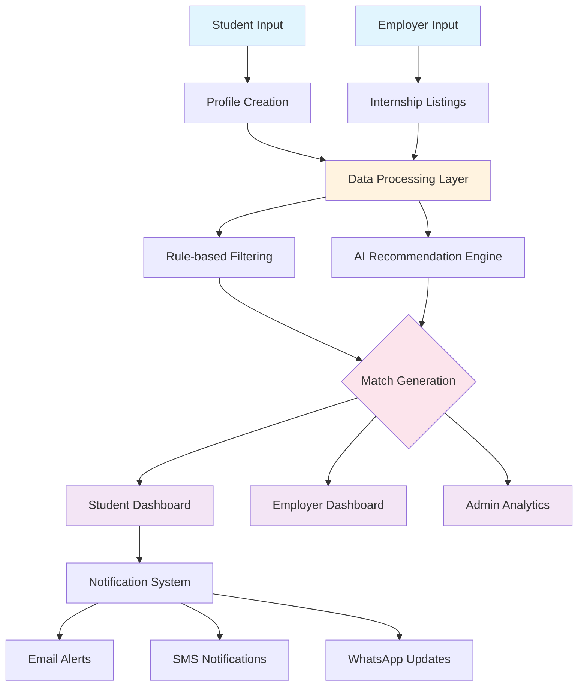

# 🎓 InternGenius - National Internship Portal

[](https://github.com/InternGenius)
[](https://github.com/InternGenius)
[](LICENSE)
[](https://education.gov.in/)

> **Connecting Students with Opportunities: Inclusive, Accessible, Intelligent**

An AI-powered platform that matches students from diverse backgrounds with relevant internship opportunities based on their skills, interests, and profile, ensuring equal access regardless of digital literacy or prior experience.

---

## 📌 Problem Statement (PS 25033)

The PM Internship Scheme receives thousands of applications from students across India's rural, tribal, and urban areas. Many of these applicants are first-generation learners with limited digital exposure and no prior internship experience.

With hundreds of opportunities available, candidates struggle to:
- Identify which internships match their skills/interests
- Avoid misaligned applications that reduce their chances
- Gain equal access regardless of background or location

👉 This leads to missed opportunities, low engagement, and inefficiency.

### **Objective**
To develop a transparent, accessible, and inclusive national internship portal that ensures students:
- Discover most relevant internships aligned with their profile
- Receive guidance through skill-based recommendations
- Gain access in an inclusive and accessible way
- Experience a government-standard digital platform with robust security and accessibility features

---

## ⚙️ System Architecture

### � Inputs
- 🎓 **Student Profile** → Education, skills, interests, location
- � **Internship Listings** → Sector, eligibility, requirements
- 📝 **Optional Skill Assessment** → Short test to refine matching

### 🔹 Processing
- ✅ Rule-based filtering (eligibility check)
- 🤖 AI-powered recommendation engine (ranking matches)

### 🔹 Outputs
- � **Student Dashboard** → Recommended internships, application tracking
- 🏢 **Employer Dashboard** → Shortlisted candidates, filtering tools
- 👩‍💼 **Admin Dashboard** → Analytics on inclusivity, region, and sector



---

## 🚀 Quick Start Installation

### **Prerequisites**
- Python 3.8+ installed
- MongoDB installed locally or MongoDB Atlas account
- Git for version control

### **1. Clone Repository**
```bash
git clone https://github.com/vishakha1221/InternGenius.git
cd InternGenius
```

### **2. Setup Virtual Environment**
```bash
# Create virtual environment
python -m venv venv

# Activate virtual environment
# Windows:
venv\Scripts\activate
# Linux/Mac:
source venv/bin/activate
```

### **3. Install Dependencies**
```bash
pip install -r requirements.txt
```

### **4. Environment Configuration**
```bash
# Copy environment template
copy .env.example .env    # Windows
cp .env.example .env      # Linux/Mac

# Edit .env file with your settings:
# - MongoDB connection string
# - Secret keys
# - Email configuration (optional)
```

### **5. Setup MongoDB**
```bash
# Option 1: Local MongoDB
# Install MongoDB locally and ensure it's running on port 27017

# Option 2: MongoDB Atlas (Cloud)
# Create account at https://cloud.mongodb.com
# Create cluster and get connection string
# Update MONGO_URI in .env file
```

### **6. Run Application**
```bash
# Method 1: Using run script (recommended)
python run.py

# Method 2: Using Flask directly
flask run

# Application will be available at: http://127.0.0.1:5000
```

### **7. Access the Application**
- **Homepage**: http://127.0.0.1:5000/
- **Login**: http://127.0.0.1:5000/auth/login
- **Sign Up**: http://127.0.0.1:5000/auth/signup

### **8. Registration Process**
The registration process consists of two steps:
1. **Direct Role-Based Registration**: Based on user role (student, company, admin)
   - Basic user information collection
   - Role-specific initial data collection
2. **Role-Specific Profile Completion**:
   - **Student Profile**: Academic information, skills, resume, etc.
   - **Company Profile**: Company details, industry, logo, verification documents
   - **Admin Profile**: Department, authorization documents, security questions

Each role has a dedicated registration flow with appropriate fields and validation.

### **9. Create Test Accounts**
```
Student Account:
- Navigate to /auth/student to access direct student registration
- Complete the initial registration form
- Complete the student profile form
- Access student dashboard at /student/dashboard

Company Account:  
- Navigate to /auth/company to access direct company registration
- Complete the initial registration form
- Complete the company profile form
- Access company dashboard at /company/dashboard

Admin Account:
- Navigate to /auth/admin to access direct admin registration
- Complete the initial registration form
- Complete the admin profile form with verification code
- Access admin dashboard at /admin/dashboard
```

---

## 🏗️ Project Structure

```
InternGenius/
├── 📄 app.py                     # Flask application factory
├── 📄 config.py                  # Configuration settings  
├── 📄 requirements.txt           # Python dependencies
├── 📄 run.py                     # Application runner
├── 📄 .env.example              # Environment template
├── 📄 .gitignore                # Git ignore rules
│
├── 📁 models/                    # Database models
│   └── 📄 user_model.py         # User authentication
│
├── 📁 routes/                    # Flask Blueprints
│   ├── 📄 auth_routes.py        # Login/Signup
│   ├── 📄 student_routes.py     # Student features
│   ├── 📄 company_routes.py     # Company features
│   └── 📄 admin_routes.py       # Admin features
│
├── 📁 forms/                     # WTForms
│   └── 📄 auth_forms.py         # Authentication forms
│
├── 📁 templates/                 # HTML templates
│   ├── 📄 base.html             # Base layout
│   ├── 📄 index.html            # Homepage
│   ├── 📁 auth/                 # Login/Signup pages
│   ├── 📁 dashboards/           # Role-based dashboards
│   └── 📁 errors/               # Error pages
│
├── 📁 static/                    # CSS, JS, Images
│   ├── 📁 css/style.css         # Custom styles
│   └── 📁 js/main.js            # Custom JavaScript
│
└── 📁 ml_module/                 # 🤖 Machine Learning
    ├── 📄 dropout_predictor.py  # Student risk assessment
    ├── 📄 recommendation_engine.py # Internship matching
    └── 📁 models/               # Trained ML models
```

---

## 🎯 User Roles & Features

### **🎓 Student Dashboard**
- **Profile Management**: Personal info, education, skills
- **Internship Discovery**: Browse and search opportunities
- **Application Tracking**: Monitor application status
- **AI Recommendations**: Personalized suggestions
- **Risk Assessment**: Academic performance monitoring

### **🏢 Company Dashboard**
- **Internship Posting**: Create and manage opportunities
- **Candidate Management**: Review applications
- **Analytics**: Track posting performance
- **Communication**: Message potential interns

### **🛡️ Admin Dashboard**
- **User Management**: Oversee all accounts
- **System Analytics**: Platform metrics
- **ML Model Management**: Monitor predictions
- **Content Moderation**: Review postings

---

## 🤖 Machine Learning Features

### **Dropout Prediction System**
- **Risk Factors Analyzed**:
  - Attendance percentage (< 60% = High Risk)
  - Grade trends (improving/declining/stable)
  - Assessment scores and assignment completion
  - Fee payment status and financial issues
  - Academic history (backlogs, course changes)
  - Behavioral patterns (participation, library usage)

### **Risk Assessment Categories**
- 🟢 **Low Risk**: Performing well across metrics
- 🟡 **Medium Risk**: Some concerning patterns
- 🔴 **High Risk**: Multiple risk factors detected

### **Intelligent Recommendations**
- Profile-based internship matching
- Skill gap analysis
- Career path suggestions
- Academic improvement strategies

---

## 🛠️ Technology Stack

### **Backend**
- **Flask 2.3.3**: Web framework
- **PyMongo**: MongoDB integration
- **Flask-Login**: Authentication
- **Flask-WTF**: Form handling
- **Flask-Bcrypt**: Password security

### **Frontend**
- **Bootstrap 5.3**: UI framework
- **Jinja2**: Template engine
- **Font Awesome**: Icons
- **Custom CSS/JS**: Enhanced UX

### **Machine Learning**
- **Scikit-learn**: ML algorithms
- **Pandas/NumPy**: Data processing
- **Joblib**: Model persistence
- **Matplotlib**: Visualization

### **Database**
- **MongoDB**: NoSQL database
- **Collections**: Users, Profiles, Internships, Applications

---

## 🔐 Security Features

- **Password Hashing**: Bcrypt encryption
- **Session Management**: Flask-Login sessions
- **Role-Based Access**: Route protection decorators
- **CSRF Protection**: WTForms CSRF tokens
- **Input Validation**: Server-side form validation

---

## 🚀 How It Works

### **1. Student Onboarding & Profiling**
- **🎓 Education Details**: Qualification, institution, specialization, grades
- **🔧 Skill Assessment**: Technical, soft skills, and competencies
- **🗺️ Geographic Preferences**: Location preferences and mobility options
- **🎯 Career Interests**: Sectors, roles, and long-term goals

### **2. Internship Opportunity Management**

#### **Listing Creation & Curation**
- Standardized format for all internship opportunities
- Detailed skill requirements and eligibility criteria
- Clear expectations, duration, and stipend information
- Location, mode (remote/in-person), and sector categorization

#### **Intelligent Matching Algorithm**
- Primary filtering based on eligibility criteria
- AI-powered ranking based on skill alignment
- Consideration for geographic constraints and preferences
- Diversity and inclusion factors in recommendation

### **3. User Interfaces**

#### **� Student Dashboard**
- Personalized internship recommendations
- Application tracking and status updates
- Skill gap analysis and improvement suggestions
- Document management for resumes and certificates

#### **🏢 Employer Dashboard**
- Candidate shortlisting and filtering tools
- Application review and management
- Interview scheduling and feedback recording
- Analytics on applicant pool and diversity metrics

#### **👩‍💼 Admin Dashboard**
- Platform-wide usage analytics
- Regional and demographic insights
- Sector-wise application distribution
- Performance metrics and system health monitoring

### **4. Notification & Engagement System**
- Smart alerts for matching opportunities
- Application deadline reminders
- Interview preparation resources
- Feedback collection mechanisms

---

## ✨ Key Features

| Feature | Description | Impact |
|---------|-------------|--------|
| 🎓 **Student Profiling** | Collects education, skills, and preferences | Personalized recommendations |
| � **Internship Curation** | Curated listings + smart filters | Reduces confusion & misaligned applications |
| � **Skill Test (Optional)** | In-built quiz with anti-cheating | Ensures fair shortlisting |
| 🤖 **AI Recommendation Engine** | Matches profiles to best-fit opportunities | Increases placement success |
| � **Alerts & Notifications** | SMS/Email/WhatsApp updates | Keeps students engaged |
| 🌍 **Accessibility** | Simple UI + multilingual support | Inclusivity for all learners |
| 📊 **Analytics Dashboard** | Real-time insights for admins | Data-driven decisions |

---

## 📊 Expected Impact

- 🎯 **Better alignment** between student skills and internship opportunities
- 📈 **Increased internship success rate** across India
- 🌍 **Inclusivity** for rural, tribal, and underserved youth
- 🏢 **Streamlined recruitment** process for employers

### **For Students**
- ✅ **Relevant opportunities** that match their true potential
- ✅ **Equal access** regardless of background or location
- ✅ **Skill development** guidance based on market demand
- ✅ **Higher selection rates** through better-matched applications

### **For Employers**
- ✅ **Qualified candidates** aligned with position requirements
- ✅ **Diverse talent pool** from across regions
- ✅ **Reduced screening time** through pre-matched profiles
- ✅ **Higher retention** due to better fit

### **For Administrators**
- ✅ **Data-driven insights** on internship ecosystem
- ✅ **Improved placement metrics** across institutions
- ✅ **Enhanced inclusivity** tracking and reporting
- ✅ **Scalable solution** for national implementation

---

## 🛠️ Tech Stack

### **Frontend**
- **Framework**: React.js / Next.js
- **Styling**: TailwindCSS
- **UI/UX**: Responsive design with accessibility features
- **Mobile**: Progressive Web App (PWA)

### **Backend**
- **API**: FastAPI / Node.js (Express)
- **Database**: PostgreSQL / MySQL
- **AI Engine**: Scikit-learn / TensorFlow (Recommendation System)
- **Authentication**: OAuth 2.0 / JWT

### **Integration & Deployment**
- **Notifications**: Twilio / SendGrid API
- **Language Support**: I18n internationalization
- **Accessibility**: WCAG 2.1 compliance
- **Deployment**: Docker + AWS / Azure / GCP

---

## 📋 Installation & Setup

### **Prerequisites**
- Node.js (v16+) or Python (3.8+)
- PostgreSQL/MySQL database
- Git for version control

### **Quick Start**
```bash
# Clone the repository
git clone https://github.com/vishakha1221/InternGenius.git
cd InternGenius

# Install dependencies
npm install  # or pip install -r requirements.txt

# Setup environment variables
cp .env.example .env
# Edit .env with your database and API credentials

# Initialize database
npm run migrate  # or python manage.py migrate

# Start the development server
npm start  # or python app.py
```

### **Data Setup**
```bash
# Import sample internship data
npm run seed-internships

# Import sample student profiles
npm run seed-profiles
```

---

## 📊 Usage Examples

### **1. Student Profile Creation**
```javascript
// Create new student profile
const studentProfile = await createProfile({
  education: {
    degree: "B.Tech",
    institution: "NIT Surat",
    specialization: "Computer Science",
    gradYear: 2023
  },
  skills: ["Python", "Data Analysis", "Web Development"],
  interests: ["AI/ML", "Software Development"],
  location: {
    current: "Surat, Gujarat",
    preferred: ["Ahmedabad", "Pune", "Remote"]
  }
});
```

### **2. Internship Matching**
```javascript
// Get personalized internship recommendations
const recommendations = await getRecommendations({
  studentId: "user123",
  filters: {
    remote: true,
    duration: "3-6 months",
    stipend: "paid"
  },
  limit: 10
});
```

### **3. Sending Notifications**
```javascript
// Send opportunity alerts to students
await sendNotifications({
  recipientType: "student",
  filters: {
    interests: ["Data Science"],
    location: "Gujarat"
  },
  template: "new-opportunity",
  data: {
    internshipId: "intern456",
    deadline: "2025-09-30"
  }
});
```

---

## 🤝 Contributing

We welcome contributions from educators, developers, and students! Here's how you can help:

### **Ways to Contribute**
- 🐛 **Bug Reports**: Report issues or unexpected behavior
- 💡 **Feature Requests**: Suggest new functionality
- 📝 **Documentation**: Improve guides and examples
- 🔧 **Code Contributions**: Submit pull requests
- 🧪 **Testing**: Help test new features
- 🎨 **UI/UX**: Improve user interface design

### **Development Process**
1. Fork the repository
2. Create a feature branch (`git checkout -b feature/amazing-feature`)
3. Make your changes
4. Test thoroughly
5. Commit your changes (`git commit -m 'Add amazing feature'`)
6. Push to the branch (`git push origin feature/amazing-feature`)
7. Open a Pull Request

---

## � Roadmap

### **Phase 1: Foundation**
- 📋 Student profiles + Internship DB + Basic filtering
- 📋 User authentication and profile management
- 📋 Core matching algorithm implementation
- 📋 Basic dashboard interfaces

### **Phase 2: Intelligence**
- � AI recommendation engine integration
- � Skill test integration and assessment
- � Advanced matching algorithms
- � Performance analytics implementation

### **Phase 3: Engagement**
- 📋 Notifications and alert systems
- 📋 Employer dashboards and candidate filtering
- 📋 Application tracking and status updates
- 📋 Feedback and rating systems

### **Phase 4: Scale & Access**
- 📋 Multilingual support for regional languages
- 📋 Accessibility enhancements for all users
- 📋 Mobile optimization and offline capabilities
- 📋 Pan-India scaling and performance optimization

---

## 📞 Support & Contact

### **Get Help**
- 📚 **Documentation**: [Wiki](https://github.com/vishakha1221/InternGenius/wiki)
- 💬 **Discussions**: [GitHub Discussions](https://github.com/vishakha1221/InternGenius/discussions)
- 🐛 **Issues**: [Bug Reports](https://github.com/vishakha1221/InternGenius/issues)
- 📧 **Email**: support@interngenius.com

### **Community**
- 🌟 **Star** this repository if you find it useful
- 👥 **Follow** for updates and announcements
- 🐦 **Twitter**: [@InternGenius](https://twitter.com/interngenius)
- 💼 **LinkedIn**: [InternGenius](https://linkedin.com/company/interngenius)

---

## 📄 License

This project is licensed under the MIT License - see the [LICENSE](LICENSE) file for details.

---

## �‍💻 Team

**Team InternGenius**
- Pujan Shah - Team Leader
- [Add other members with roles]

## �🙏 Acknowledgments

- PM Internship Scheme for the opportunity
- Open-source community for foundational tools
- Students from diverse backgrounds who provided insights
- Contributors who help improve the system

---

<div align="center">

**Made with ❤️ for Inclusive Opportunity Access**

[⭐ Star this repository](https://github.com/vishakha1221/InternGenius) | [🐛 Report Bug](https://github.com/vishakha1221/InternGenius/issues) | [💡 Request Feature](https://github.com/vishakha1221/InternGenius/issues)

</div>
