# 🎓 InternGenius - National Internship Portal

[](https://github.com/InternGenius)
[](https://github.com/InternGenius)
[](LICENSE)
[](https://education.gov.in/)

> **Connecting Students with Opportunities: Inclusive, Accessible, Intelligent**

## Project Overview

InternGenius is a comprehensive AI-powered national internship platform designed to connect students with relevant internship opportunities based on their skills, interests, and profiles. Our mission is to ensure equal access to quality internships for all students, regardless of their background or digital literacy. This project is developed as part of the Smart India Hackathon (SIH) to address the need for an inclusive and accessible national internship portal.

### Quick Start Installation

1. Ensure you have Python 3.8+ installed
2. Set up virtual environment (venv):
   ```
   python -m venv venv
   venv\Scripts\activate  # Windows
   source venv/bin/activate  # Linux/Mac
   ```
3. Install dependencies:
   ```
   pip install -r requirements.txt
   ```
4. Run the application:
   ```
   python app.py
   ```
5. Open your browser and go to `http://127.0.0.1:5000`

An AI-powered platform that matches students from diverse backgrounds with relevant internship opportunities based on their skills, interests, and profile, ensuring equal access regardless of digital literacy or prior experience.

---

## 📌 Problem Statement (PS 25033)

The PM Internship Scheme receives thousands of applications from students across India's rural, tribal, and urban areas. Many of these applicants are first-generation learners with limited digital exposure and no prior internship experience.

With hundreds of opportunities available, candidates struggle to:
- Identify which internships match their skills/interests
- Avoid misaligned applications that reduce their chances
- Gain equal access regardless of background or location

👉 This leads to missed opportunities, low engagement, and inefficiency.

### **Objective**
To develop a transparent, accessible, and inclusive national internship portal that ensures students:
- Discover most relevant internships aligned with their profile
- Receive guidance through skill-based recommendations
- Gain access in an inclusive and accessible way
- Experience a government-standard digital platform with robust security and accessibility features

---

## ⚙️ System Architecture

### � Inputs
- 🎓 **Student Profile** → Education, skills, interests, location
- � **Internship Listings** → Sector, eligibility, requirements
- 📝 **Optional Skill Assessment** → Short test to refine matching

### 🔹 Processing
- ✅ Rule-based filtering (eligibility check)
- 🤖 AI-powered recommendation engine (ranking matches)

### 🔹 Outputs
- � **Student Dashboard** → Recommended internships, application tracking
- 🏢 **Employer Dashboard** → Shortlisted candidates, filtering tools
- 👩‍💼 **Admin Dashboard** → Analytics on inclusivity, region, and sector

```mermaid
flowchart TD
    A[👨‍🎓 Student Input] --> B[📝 Profile Creation]
    C[🏢 Employer Input] --> D[📋 Internship Listings]
    
    B --> E[⚙️ Data Processing Layer]
    D --> E
    
    E --> F[🔍 Rule-based Filtering]
    E --> G[🤖 AI Recommendation Engine]
    
    F --> H{🎯 Match Generation}
    G --> H
    
    H --> I[📊 Student Dashboard]
    H --> J[💼 Employer Dashboard]
    H --> K[📈 Admin Analytics]
    
    I --> L[🔔 Notification System]
    
    L --> M[📧 Email Alerts]
    L --> N[📱 SMS Notifications]
    L --> O[💬 WhatsApp Updates]
    
    %% Input nodes - Blue gradient
    style A fill:#4fc3f7,stroke:#0277bd,stroke-width:2px,color:#fff
    style C fill:#4fc3f7,stroke:#0277bd,stroke-width:2px,color:#fff
    
    %% Profile creation - Green gradient
    style B fill:#66bb6a,stroke:#388e3c,stroke-width:2px,color:#fff
    style D fill:#66bb6a,stroke:#388e3c,stroke-width:2px,color:#fff
    
    %% Processing layer - Orange gradient
    style E fill:#ff9800,stroke:#f57c00,stroke-width:3px,color:#fff
    
    %% AI components - Purple gradient
    style F fill:#ab47bc,stroke:#7b1fa2,stroke-width:2px,color:#fff
    style G fill:#ab47bc,stroke:#7b1fa2,stroke-width:2px,color:#fff
    
    %% Match generation - Pink gradient (decision point)
    style H fill:#ec407a,stroke:#c2185b,stroke-width:3px,color:#fff
    
    %% Dashboards - Teal gradient
    style I fill:#26a69a,stroke:#00695c,stroke-width:2px,color:#fff
    style J fill:#26a69a,stroke:#00695c,stroke-width:2px,color:#fff
    style K fill:#26a69a,stroke:#00695c,stroke-width:2px,color:#fff
    
    %% Notification system - Indigo gradient
    style L fill:#5c6bc0,stroke:#303f9f,stroke-width:2px,color:#fff
    
    %% Alert types - Light blue gradient
    style M fill:#42a5f5,stroke:#1976d2,stroke-width:2px,color:#fff
    style N fill:#42a5f5,stroke:#1976d2,stroke-width:2px,color:#fff
    style O fill:#42a5f5,stroke:#1976d2,stroke-width:2px,color:#fff
```



---

## 🚀 Quick Start Installation

### **Prerequisites**
- Python 3.8+ installed
- MongoDB installed locally or MongoDB Atlas account
- Git for version control

### **1. Clone Repository**
```bash
git clone https://github.com/vishakha1221/InternGenius.git
cd InternGenius
```

### **2. Setup Virtual Environment**
```bash
# Create virtual environment
python -m venv venv

# Activate virtual environment
# Windows:
venv\Scripts\activate
# Linux/Mac:
source venv/bin/activate
```

### **3. Install Dependencies**
```bash
pip install -r requirements.txt
```

### **4. Environment Configuration**
```bash
# Copy environment template
copy .env.example .env    # Windows
cp .env.example .env      # Linux/Mac

# Edit .env file with your settings:
# - MongoDB connection string
# - Secret keys
# - Email configuration (optional)
```

### **5. Setup MongoDB**
```bash
# Option 1: Local MongoDB
# Install MongoDB locally and ensure it's running on port 27017

# Option 2: MongoDB Atlas (Cloud)
# Create account at https://cloud.mongodb.com
# Create cluster and get connection string
# Update MONGO_URI in .env file
```

### **6. Run Application**
```bash
# Method 1: Direct application run (recommended)
python app.py

# Method 2: Using Flask directly
flask run

# Application will be available at: http://127.0.0.1:5000
```

---

## ☁️ Deploy to Render.com

We include a `Procfile` and a `render.yaml` so you can deploy with one click.

### Option A: Render Blueprint (recommended)
1. Push your changes to GitHub.
2. Go to https://render.com and click New → Blueprint.
3. Paste your repository URL; Render will read `render.yaml`.
4. Set environment variables:
  - `MONGO_URI` → your MongoDB Atlas or local tunnel URI
  - `FLASK_ENV=production` (already set in render.yaml)
  - `SECRET_KEY` is auto-generated by Render per `render.yaml` (or set your own)
5. Create Web Service → Deploy.

Notes:
- We mount a persistent disk at `static/uploads` so resumes/photos survive restarts.
- Health check path is `/`.
- Gunicorn entrypoint: `gunicorn app:app --bind 0.0.0.0:$PORT` (see Procfile).

### Option B: Manual Web Service
1. New → Web Service → connect your repo.
2. Runtime: Python
3. Build Command: `pip install -r requirements.txt`
4. Start Command: `gunicorn app:app --bind 0.0.0.0:$PORT --workers 2 --threads 4 --timeout 120`
5. Add environment variables:
  - `PYTHON_VERSION=3.10.14`
  - `FLASK_ENV=production`
  - `SECRET_KEY=<your-random-secret>`
  - `MONGO_URI=<your-connection-string>`
6. (Optional) Add a disk and mount it to `static/uploads` for user files.

Troubleshooting:
- If MongoDB Atlas isn’t reachable from Render (network rules), verify IP allow-list and credentials.
- If uploads don’t persist, ensure the disk mount is present and the app is writing to `static/uploads`.
- Check Logs tab for connection messages (we print clear diagnostics at startup).

---

## ✈️ Deploy to Fly.io

We added a Dockerfile and `fly.toml` so you can deploy on Fly quickly.

### Prerequisites
- Install the Fly CLI: https://fly.io/docs/hands-on/install-flyctl/
- Create an account and log in: `fly auth signup` then `fly auth login`

### 1) Launch the app
This will read `fly.toml` and set up the app in your nearest region (we defaulted to `bom`).

```powershell
fly launch --no-deploy
```

If prompted about a Postgres/Redis, choose No for now.

### 2) Create a volume for uploads
We store resumes/photos under `static/uploads`. Create a persistent volume and name it `uploads_data` (matches `[[mounts]]` in `fly.toml`).

```powershell
fly volumes create uploads_data --size 1 --region bom
```

### 3) Set secrets
Set your environment secrets so the app can connect to MongoDB and secure sessions.

```powershell
fly secrets set MONGO_URI="<your-mongodb-connection-string>" SECRET_KEY="<your-random-secret>"
```

Tip: You can generate a strong secret locally and reuse it.

### 4) Deploy

```powershell
fly deploy
```

The service listens on port 8080 inside the container, with health checks hitting `/health`.

### 5) Open the app

```powershell
fly open
```

### Notes
- App server: Gunicorn runs `app:app` and binds to `$PORT` (on Fly it’s 8080).
- Health check: `/health` returns JSON and checks DB connectivity when configured.
- Persistent data: The volume is mounted at `/app/static/uploads`.
- Regions: Update `primary_region` in `fly.toml` to your preferred region.
- Logs: Use `fly logs` to view runtime output.

### **7. Access the Application**
- **Homepage**: http://127.0.0.1:5000/
- **Login**: http://127.0.0.1:5000/auth/login
- **Sign Up**: http://127.0.0.1:5000/auth/signup

### **8. Registration Process**
The registration process consists of a multi-step form with comprehensive data collection:

#### **Student Registration**:
1. **Personal Information**: 
   - Basic details (name, contact, DOB, gender)
   - Government IDs (Aadhaar)
   - Demographic information

2. **Education & Address**: 
   - Academic qualifications with multiple entries
   - Current residential address
   - Location details

3. **Skills & Preferences**:
   - Technical and soft skills
   - Language proficiency
   - Internship preferences (location, duration, work mode)
   - Availability status

4. **Documents & Review**:
   - Resume/CV upload (required)
   - Profile photo upload
   - Additional documents
   - Terms and conditions acceptance

The form features real-time validation, intelligent file upload handling, and a user-friendly interface with progress indicators.

### **9. Create Test Accounts**
```
Student Account:
- Navigate to /auth/student to access direct student registration
- Complete the initial registration form
- Complete the student profile form
- Access student dashboard at /student/dashboard

Company Account:  
- Navigate to /auth/company to access direct company registration
- Complete the initial registration form
- Complete the company profile form
- Access company dashboard at /company/dashboard

Admin Account:
- Navigate to /auth/admin to access direct admin registration
- Complete the initial registration form
- Complete the admin profile form with verification code
- Access admin dashboard at /admin/dashboard
```

---

## 🏗️ Project Structure

```
InternGenius/
├── 📄 app.py                     # Flask application factory
├── 📄 config.py                  # Configuration settings  
├── 📄 requirements.txt           # Python dependencies
├── 📄 run.py                     # Application runner
├── 📄 .env.example              # Environment template
├── 📄 .gitignore                # Git ignore rules
│
├── 📁 models/                    # Database models
│   └── 📄 user_model.py         # User authentication
│
├── 📁 routes/                    # Flask Blueprints
│   ├── 📄 auth_routes.py        # Login/Signup
│   ├── 📄 student_routes.py     # Student features
│   ├── 📄 company_routes.py     # Company features
│   └── 📄 admin_routes.py       # Admin features
│
├── 📁 forms/                     # WTForms
│   └── 📄 auth_forms.py         # Authentication forms
│
├── 📁 templates/                 # HTML templates
│   ├── 📄 base.html             # Base layout
│   ├── 📄 index.html            # Homepage
│   ├── 📁 auth/                 # Login/Signup pages
│   ├── 📁 dashboards/           # Role-based dashboards
│   └── 📁 errors/               # Error pages
│
├── 📁 static/                    # CSS, JS, Images
│   ├── 📁 css/style.css         # Custom styles
│   └── 📁 js/main.js            # Custom JavaScript
│
└── 📁 ml_module/                 # 🤖 Machine Learning
    ├── 📄 dropout_predictor.py  # Student risk assessment
    ├── 📄 recommendation_engine.py # Internship matching
    └── 📁 models/               # Trained ML models
```

---

## 🎯 User Roles & Features

### **🎓 Student Dashboard**
- **Profile Management**: Personal info, education, skills
- **Internship Discovery**: Browse and search opportunities
- **Application Tracking**: Monitor application status
- **AI Recommendations**: Personalized suggestions
- **Risk Assessment**: Academic performance monitoring

### **🏢 Company Dashboard**
- **Internship Posting**: Create and manage opportunities
- **Candidate Management**: Review applications
- **Analytics**: Track posting performance
- **Communication**: Message potential interns

### **🛡️ Admin Dashboard**
- **User Management**: Oversee all accounts
- **System Analytics**: Platform metrics
- **ML Model Management**: Monitor predictions
- **Content Moderation**: Review postings

---

## 🤖 Machine Learning Features

### **Dropout Prediction System**
- **Risk Factors Analyzed**:
  - Attendance percentage (< 60% = High Risk)
  - Grade trends (improving/declining/stable)
  - Assessment scores and assignment completion
  - Fee payment status and financial issues
  - Academic history (backlogs, course changes)
  - Behavioral patterns (participation, library usage)

### **Risk Assessment Categories**
- 🟢 **Low Risk**: Performing well across metrics
- 🟡 **Medium Risk**: Some concerning patterns
- 🔴 **High Risk**: Multiple risk factors detected

### **Intelligent Recommendations**
- Profile-based internship matching
- Skill gap analysis
- Career path suggestions
- Academic improvement strategies

---

## 🛠️ Technology Stack

### **Backend**
- **Flask 2.3.3**: Web framework
- **PyMongo**: MongoDB integration
- **Flask-Login**: Authentication
- **Flask-WTF**: Form handling
- **Flask-Bcrypt**: Password security

### **Frontend**
- **Bootstrap 5.3**: UI framework
- **Jinja2**: Template engine
- **Font Awesome**: Icons
- **Custom CSS/JS**: Enhanced UX

### **Machine Learning**
- **Scikit-learn**: ML algorithms
- **Pandas/NumPy**: Data processing
- **Joblib**: Model persistence
- **Matplotlib**: Visualization

### **Database**
- **MongoDB**: NoSQL database
- **Collections**: Users, Profiles, Internships, Applications

---

## 🔐 Security Features

- **Password Hashing**: Bcrypt encryption
- **Session Management**: Flask-Login sessions
- **Role-Based Access**: Route protection decorators
- **CSRF Protection**: WTForms CSRF tokens
- **Input Validation**: Server-side form validation

---

## 🚀 How It Works

### **1. Student Onboarding & Profiling**
- **🎓 Education Details**: Qualification, institution, specialization, grades
- **🔧 Skill Assessment**: Technical, soft skills, and competencies
- **🗺️ Geographic Preferences**: Location preferences and mobility options
- **🎯 Career Interests**: Sectors, roles, and long-term goals

### **2. Internship Opportunity Management**

#### **Listing Creation & Curation**
- Standardized format for all internship opportunities
- Detailed skill requirements and eligibility criteria
- Clear expectations, duration, and stipend information
- Location, mode (remote/in-person), and sector categorization

#### **Intelligent Matching Algorithm**
- Primary filtering based on eligibility criteria
- AI-powered ranking based on skill alignment
- Consideration for geographic constraints and preferences
- Diversity and inclusion factors in recommendation

### **3. User Interfaces**

#### **� Student Dashboard**
- Personalized internship recommendations
- Application tracking and status updates
- Skill gap analysis and improvement suggestions
- Document management for resumes and certificates

#### **🏢 Employer Dashboard**
- Candidate shortlisting and filtering tools
- Application review and management
- Interview scheduling and feedback recording
- Analytics on applicant pool and diversity metrics

#### **👩‍💼 Admin Dashboard**
- Platform-wide usage analytics
- Regional and demographic insights
- Sector-wise application distribution
- Performance metrics and system health monitoring

### **4. Notification & Engagement System**
- Smart alerts for matching opportunities
- Application deadline reminders
- Interview preparation resources
- Feedback collection mechanisms

---

## ✨ Key Features

| Feature | Description | Impact |
|---------|-------------|--------|
| 🎓 **Student Profiling** | Collects education, skills, and preferences | Personalized recommendations |
| � **Internship Curation** | Curated listings + smart filters | Reduces confusion & misaligned applications |
| � **Skill Test (Optional)** | In-built quiz with anti-cheating | Ensures fair shortlisting |
| 🤖 **AI Recommendation Engine** | Matches profiles to best-fit opportunities | Increases placement success |
| � **Alerts & Notifications** | SMS/Email/WhatsApp updates | Keeps students engaged |
| 🌍 **Accessibility** | Simple UI + multilingual support | Inclusivity for all learners |
| 📊 **Analytics Dashboard** | Real-time insights for admins | Data-driven decisions |

---

## 📊 Expected Impact

- 🎯 **Better alignment** between student skills and internship opportunities
- 📈 **Increased internship success rate** across India
- 🌍 **Inclusivity** for rural, tribal, and underserved youth
- 🏢 **Streamlined recruitment** process for employers

### **For Students**
- ✅ **Relevant opportunities** that match their true potential
- ✅ **Equal access** regardless of background or location
- ✅ **Skill development** guidance based on market demand
- ✅ **Higher selection rates** through better-matched applications

### **For Employers**
- ✅ **Qualified candidates** aligned with position requirements
- ✅ **Diverse talent pool** from across regions
- ✅ **Reduced screening time** through pre-matched profiles
- ✅ **Higher retention** due to better fit

### **For Administrators**
- ✅ **Data-driven insights** on internship ecosystem
- ✅ **Improved placement metrics** across institutions
- ✅ **Enhanced inclusivity** tracking and reporting
- ✅ **Scalable solution** for national implementation

---

## 🛠️ Tech Stack

### **Frontend**
- **Framework**: React.js / Next.js
- **Styling**: TailwindCSS
- **UI/UX**: Responsive design with accessibility features
- **Mobile**: Progressive Web App (PWA)

### **Backend**
- **API**: FastAPI / Node.js (Express)
- **Database**: PostgreSQL / MySQL
- **AI Engine**: Scikit-learn / TensorFlow (Recommendation System)
- **Authentication**: OAuth 2.0 / JWT

### **Integration & Deployment**
- **Notifications**: Twilio / SendGrid API
- **Language Support**: I18n internationalization
- **Accessibility**: WCAG 2.1 compliance
- **Deployment**: Docker + AWS / Azure / GCP

---

## 📋 Installation & Setup

### **Prerequisites**
- Node.js (v16+) or Python (3.8+)
- PostgreSQL/MySQL database
- Git for version control

### **Quick Start**
```bash
# Clone the repository
git clone https://github.com/vishakha1221/InternGenius.git
cd InternGenius

# Install dependencies
npm install  # or pip install -r requirements.txt

# Setup environment variables
cp .env.example .env
# Edit .env with your database and API credentials

# Initialize database
npm run migrate  # or python manage.py migrate

# Start the development server
npm start  # or python app.py
```

### **Data Setup**
```bash
# Import sample internship data
npm run seed-internships

# Import sample student profiles
npm run seed-profiles
```

---

## 📊 Usage Examples

### **1. Student Profile Creation**
```javascript
// Create new student profile
const studentProfile = await createProfile({
  education: {
    degree: "B.Tech",
    institution: "NIT Surat",
    specialization: "Computer Science",
    gradYear: 2023
  },
  skills: ["Python", "Data Analysis", "Web Development"],
  interests: ["AI/ML", "Software Development"],
  location: {
    current: "Surat, Gujarat",
    preferred: ["Ahmedabad", "Pune", "Remote"]
  }
});
```

### **2. Internship Matching**
```javascript
// Get personalized internship recommendations
const recommendations = await getRecommendations({
  studentId: "user123",
  filters: {
    remote: true,
    duration: "3-6 months",
    stipend: "paid"
  },
  limit: 10
});
```

### **3. Sending Notifications**
```javascript
// Send opportunity alerts to students
await sendNotifications({
  recipientType: "student",
  filters: {
    interests: ["Data Science"],
    location: "Gujarat"
  },
  template: "new-opportunity",
  data: {
    internshipId: "intern456",
    deadline: "2025-09-30"
  }
});
```

---

## 🤝 Contributing

We welcome contributions from educators, developers, and students! Here's how you can help:

### **Ways to Contribute**
- 🐛 **Bug Reports**: Report issues or unexpected behavior
- 💡 **Feature Requests**: Suggest new functionality
- 📝 **Documentation**: Improve guides and examples
- 🔧 **Code Contributions**: Submit pull requests
- 🧪 **Testing**: Help test new features
- 🎨 **UI/UX**: Improve user interface design

### **Development Process**
1. Fork the repository
2. Create a feature branch (`git checkout -b feature/amazing-feature`)
3. Make your changes
4. Test thoroughly
5. Commit your changes (`git commit -m 'Add amazing feature'`)
6. Push to the branch (`git push origin feature/amazing-feature`)
7. Open a Pull Request

---

## 🗺 Roadmap

### **Phase 1: Foundation**
- 📋 Student profiles + Internship DB + Basic filtering
- 📋 User authentication and profile management
- 📋 Core matching algorithm implementation
- 📋 Basic dashboard interfaces

### **Phase 2: Intelligence**
- 🧠 AI recommendation engine integration
- 📝 Skill test integration and assessment
- 🔍 Advanced matching algorithms
- 📊 Performance analytics implementation

### **Phase 3: Engagement**
- 📋 Notifications and alert systems
- 📋 Employer dashboards and candidate filtering
- 📋 Application tracking and status updates
- 📋 Feedback and rating systems

### **Phase 4: Scale & Access**
- 📋 Multilingual support for regional languages
- 📋 Accessibility enhancements for all users
- 📋 Mobile optimization and offline capabilities
- 📋 Pan-India scaling and performance optimization

---

## 📞 Support & Contact

### **Get Help**
- 📚 **Documentation**: [Wiki](https://github.com/vishakha1221/InternGenius/wiki)
- 💬 **Discussions**: [GitHub Discussions](https://github.com/vishakha1221/InternGenius/discussions)
- 🐛 **Issues**: [Bug Reports](https://github.com/vishakha1221/InternGenius/issues)
- 📧 **Email**: support@interngenius.com

### **Community**
- 🌟 **Star** this repository if you find it useful
- 👥 **Follow** for updates and announcements
- 🐦 **Twitter**: [@InternGenius](https://twitter.com/interngenius)
- 💼 **LinkedIn**: [InternGenius](https://linkedin.com/company/interngenius)

---

## 📄 License

This project is licensed under the MIT License - see the [LICENSE](LICENSE) file for details.

---

## 👨‍💻 Team

**Team InternGenius**
- [Add other members with roles]

## 🙏 Acknowledgments

- PM Internship Scheme for the opportunity
- Open-source community for foundational tools
- Students from diverse backgrounds who provided insights
- Contributors who help improve the system

---

<div align="center">

**Made with ❤️ for Inclusive Opportunity Access**

[⭐ Star this repository](https://github.com/vishakha1221/InternGenius) | [🐛 Report Bug](https://github.com/vishakha1221/InternGenius/issues) | [💡 Request Feature](https://github.com/vishakha1221/InternGenius/issues)

</div>
