# 🎓 InternGenius - AI-Based Drop-out Prediction & Counseling System

[](https://github.com/vishakha1221/InternGenius)
[](https://github.com/vishakha1221/InternGenius)
[](LICENSE)

> **Empowering Educational Institutions with Early Detection, Transparency, and Timely Intervention**

An intelligent system that consolidates student data from multiple sources, applies rule-based and ML-light logic to detect at-risk students, and enables proactive counseling intervention to prevent drop-outs.

---

## 🎯 Problem Statement Overview (Problem ID: 25102)

### **Objective**
Build an **AI-based drop-out prediction and counseling system** that consolidates student data from multiple sources into a single dashboard, applies transparent rule-based + ML-light logic to detect at-risk students, and notifies mentors/guardians for timely intervention.

**Focus**: Simplicity, transparency, and usability over complex analytics.

---

## 🔄 System Flowchart

```mermaid
flowchart TD
    A[📊 Data Input Layer] --> B[🔄 Data Consolidation]
    A1[📋 Attendance Spreadsheet] --> B
    A2[📝 Test/Assessment Results] --> B
    A3[💰 Fee Payment Records] --> B
    A4[🔁 Subject Attempts History] --> B
    
    B --> C[🧠 Risk Detection Engine]
    C --> D[📏 Rule-Based Thresholds]
    C --> E[🤖 ML-Light Prediction]
    
    D --> F{Risk Assessment}
    E --> F
    
    F -->|Low Risk| G1[🟢 Green Zone]
    F -->|Medium Risk| G2[🟡 Yellow Zone] 
    F -->|High Risk| G3[🔴 Red Zone]
    
    G1 --> H[📱 Dashboard Outputs]
    G2 --> H
    G3 --> H
    
    H --> I1[👨‍🏫 Mentor Dashboard]
    H --> I2[👩‍💼 Admin Dashboard]
    
    I1 --> J[🔔 Notification Engine]
    I2 --> J
    
    J --> K1[📧 Mentor Alerts]
    J --> K2[📱 Guardian SMS/Email]
    J --> K3[💬 WhatsApp Notifications]
    
    K1 --> L[🤝 Intervention & Counseling]
    K2 --> L
    K3 --> L
    
    L --> M[📝 Progress Tracking]
    M --> N[🔄 Feedback Loop]
    N --> C
    
    style A fill:#e1f5fe
    style C fill:#fff3e0
    style F fill:#fce4ec
    style H fill:#f3e5f5
    style L fill:#e8f5e8
```



---

## 🚀 How It Works

### **1. Data Collection & Integration**
- **📋 Attendance Data**: Automated import from existing spreadsheets/LMS
- **📝 Assessment Scores**: Integration with exam management systems
- **💰 Fee Records**: Connection to finance management systems
- **🔁 Academic History**: Subject attempts, backlogs, and re-appears tracking

### **2. Intelligent Risk Detection**

#### **Rule-Based Thresholds** (Transparent Logic)
- 🚨 **High Risk**: Attendance < 60%
- ⚠️ **Medium Risk**: Test scores declining > 20%
- 🚨 **High Risk**: More than 3 subject attempts
- ⚠️ **Medium Risk**: Fee dues > 1 month

#### **ML-Light Prediction** (Optional Enhancement)
- Logistic regression for drop-out probability
- Decision tree models for interpretable results
- Color-coded risk categories for instant recognition

### **3. Dashboard & Monitoring**

#### **👨‍🏫 Mentor Dashboard**
- Consolidated student records with risk indicators
- Interactive trend charts (attendance & performance)
- At-risk student highlighting with specific reasons
- Intervention history and progress tracking

#### **👩‍💼 Admin Dashboard**
- Institute-wide risk distribution analytics
- Department and batch-wise overview
- Performance metrics and system insights
- Comprehensive reporting tools

### **4. Proactive Intervention**
- **Weekly alerts** to mentors with at-risk student lists
- **Automated notifications** to parents/guardians
- **Counseling session scheduling** and tracking
- **Progress monitoring** with feedback loops

---

## ✨ Key Features

| Feature | Description | Impact |
|---------|-------------|--------|
| 📊 **Multi-Source Integration** | Seamless data import from existing systems | No disruption to current workflows |
| 🎯 **Transparent Rules** | Clear, understandable risk criteria | Easy adoption by educators |
| 🚦 **Color-Coded Alerts** | Intuitive visual risk indicators | Quick identification of at-risk students |
| 🤖 **Lightweight AI** | Optional ML enhancement | Improved accuracy without complexity |
| ⏰ **Early Detection** | Proactive risk identification | Prevention over reaction |
| 📱 **Multi-Channel Alerts** | SMS, Email, WhatsApp notifications | Comprehensive stakeholder engagement |
| 📈 **Progress Tracking** | Intervention outcome monitoring | Continuous improvement |

---

## 🎯 Target Impact

### **For Educational Institutions**
- ✅ Identify at-risk students **weeks before critical points**
- ✅ Reduce drop-out rates through **early intervention**
- ✅ Improve **student retention and success rates**
- ✅ Enhance **mentor-student relationships**

### **For Students & Families**
- ✅ **Timely support** and counseling
- ✅ **Transparent communication** about academic standing
- ✅ **Proactive guidance** for academic improvement
- ✅ **Family involvement** in student success

### **For System Administrators**
- ✅ **Data-driven insights** for institutional planning
- ✅ **Resource optimization** for counseling services
- ✅ **Compliance tracking** and reporting
- ✅ **Scalable solution** for growing institutions

---

## 🛠️ Technology Stack

### **Backend**
- **Database**: PostgreSQL/MySQL for student records
- **API**: Node.js/Express or Python/FastAPI
- **ML Engine**: Scikit-learn for lightweight models
- **Data Processing**: Pandas for data manipulation

### **Frontend**
- **Dashboard**: React.js with responsive design
- **Visualization**: Chart.js/D3.js for analytics
- **UI Framework**: Material-UI or Tailwind CSS
- **Mobile**: Progressive Web App (PWA)

### **Integration**
- **File Processing**: Support for Excel, CSV, JSON
- **Notifications**: Twilio (SMS), SendGrid (Email), WhatsApp API
- **Authentication**: JWT-based secure access
- **Deployment**: Docker containers, cloud-ready

---

## 📋 Installation & Setup

### **Prerequisites**
- Node.js (v16+) or Python (3.8+)
- PostgreSQL/MySQL database
- Git for version control

### **Quick Start**
```bash
# Clone the repository
git clone https://github.com/vishakha1221/InternGenius.git
cd InternGenius

# Install dependencies
npm install  # or pip install -r requirements.txt

# Setup environment variables
cp .env.example .env
# Edit .env with your database and API credentials

# Initialize database
npm run migrate  # or python manage.py migrate

# Start the development server
npm start  # or python app.py
```

### **Data Import**
```bash
# Import sample data
npm run import-sample-data

# Or import your own data
npm run import -- --attendance attendance.xlsx --grades grades.xlsx --fees fees.xlsx
```

---

## 📊 Usage Examples

### **1. Setting Up Risk Thresholds**
```javascript
const riskThresholds = {
  attendance: { high: 60, medium: 75 },
  gradeDecline: { high: 20, medium: 10 },
  subjectAttempts: { high: 3, medium: 2 },
  feeDues: { high: 30, medium: 15 } // days
};
```

### **2. Generating Risk Reports**
```javascript
// Get weekly at-risk students
const atRiskStudents = await generateWeeklyReport({
  department: 'Computer Science',
  semester: 3,
  riskLevel: ['medium', 'high']
});
```

### **3. Sending Notifications**
```javascript
// Notify mentors and guardians
await sendNotifications({
  students: atRiskStudents,
  channels: ['email', 'sms'],
  template: 'weekly-alert'
});
```

---

## 🤝 Contributing

We welcome contributions from educators, developers, and students! Here's how you can help:

### **Ways to Contribute**
- 🐛 **Bug Reports**: Report issues or unexpected behavior
- 💡 **Feature Requests**: Suggest new functionality
- 📝 **Documentation**: Improve guides and examples
- 🔧 **Code Contributions**: Submit pull requests
- 🧪 **Testing**: Help test new features
- 🎨 **UI/UX**: Improve user interface design

### **Development Process**
1. Fork the repository
2. Create a feature branch (`git checkout -b feature/amazing-feature`)
3. Make your changes
4. Test thoroughly
5. Commit your changes (`git commit -m 'Add amazing feature'`)
6. Push to the branch (`git push origin feature/amazing-feature`)
7. Open a Pull Request

---

## 📈 Roadmap

### **Phase 1: Foundation** (Current)
- ✅ Basic data ingestion and consolidation
- ✅ Rule-based risk detection
- ✅ Simple dashboard interface
- 🔄 Notification system implementation

### **Phase 2: Enhancement** (Next 3 months)
- 🔄 ML model integration
- 🔄 Advanced analytics and reporting
- 🔄 Mobile application development
- 🔄 Integration with popular LMS platforms

### **Phase 3: Scale** (6 months)
- 📋 Multi-institution support
- 📋 Advanced intervention workflows
- 📋 Predictive analytics dashboard
- 📋 API marketplace for third-party integrations

### **Phase 4: Innovation** (12 months)
- 📋 AI-powered counseling recommendations
- 📋 Behavioral pattern analysis
- 📋 Outcome prediction modeling
- 📋 Research collaboration features

---

## 📞 Support & Contact

### **Get Help**
- 📚 **Documentation**: [Wiki](https://github.com/vishakha1221/InternGenius/wiki)
- 💬 **Discussions**: [GitHub Discussions](https://github.com/vishakha1221/InternGenius/discussions)
- 🐛 **Issues**: [Bug Reports](https://github.com/vishakha1221/InternGenius/issues)
- 📧 **Email**: support@interngenius.com

### **Community**
- 🌟 **Star** this repository if you find it useful
- 👥 **Follow** for updates and announcements
- 🐦 **Twitter**: [@InternGenius](https://twitter.com/interngenius)
- 💼 **LinkedIn**: [InternGenius](https://linkedin.com/company/interngenius)

---

## 📄 License

This project is licensed under the MIT License - see the [LICENSE](LICENSE) file for details.

---

## 🙏 Acknowledgments

- Educational institutions for providing valuable insights
- Open-source community for foundational tools
- Students and educators who inspired this solution
- Contributors who help improve the system

---

<div align="center">

**Made with ❤️ for Educational Excellence**

[⭐ Star this repository](https://github.com/vishakha1221/InternGenius) | [🐛 Report Bug](https://github.com/vishakha1221/InternGenius/issues) | [💡 Request Feature](https://github.com/vishakha1221/InternGenius/issues)

</div>
